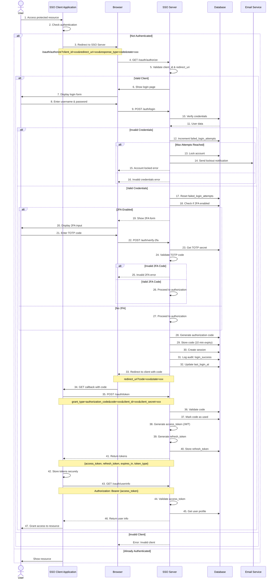
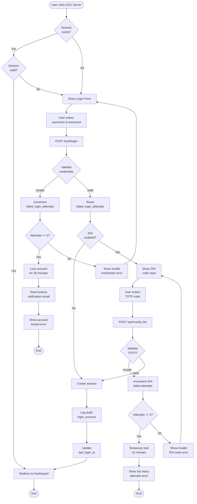
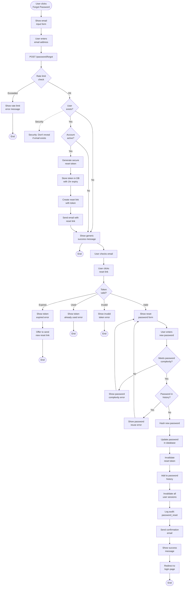
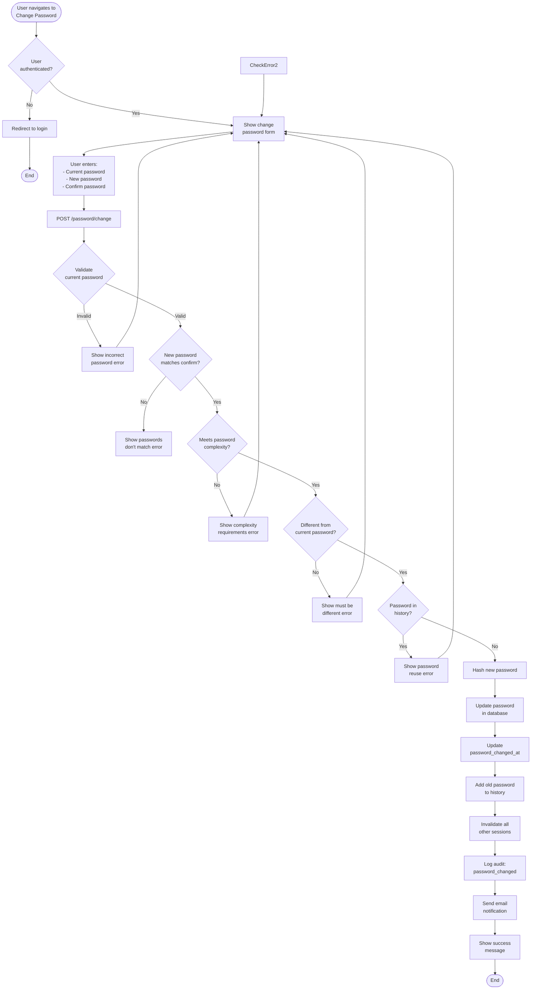
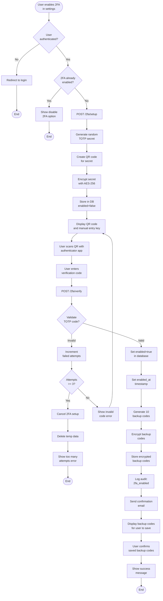
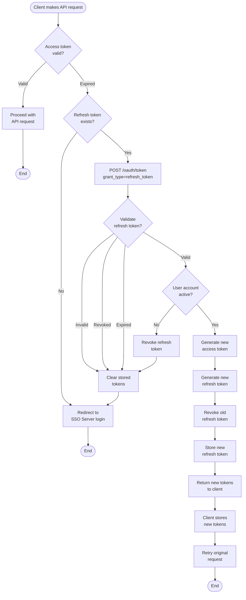
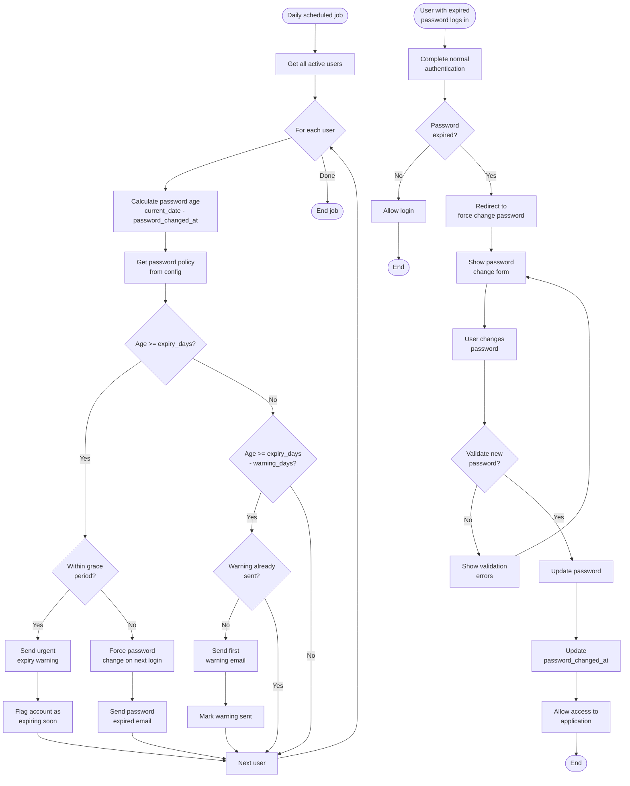

# SSO System - Flowcharts

## 1. Complete OAuth2 Authorization Flow



## 2. Login Flow with 2FA



## 3. Forgot Password Flow



## 4. Change Password Flow (Logged In User)



## 5. Two-Factor Authentication Setup Flow



## 6. Token Refresh Flow



## 7. Session Management Flow

```mermaid
flowchart TD
    Start([User makes request]) --> CheckCookie{Session cookie<br/>present?}
    
    CheckCookie -->|No| Unauthenticated[Return<br/>unauthenticated]
    Unauthenticated --> End1([End])
    
    CheckCookie -->|Yes| LookupSession[Lookup session<br/>in database]
    
    LookupSession --> SessionExists{Session<br/>exists?}
    
    SessionExists -->|No| DeleteCookie[Clear session<br/>cookie]
    DeleteCookie --> Unauthenticated
    
    SessionExists -->|Yes| CheckExpiry{Session<br/>expired?}
    
    CheckExpiry -->|Yes| DeleteSession[Delete session<br/>from DB]
    DeleteSession --> DeleteCookie
    
    CheckExpiry -->|No| CheckUser{User account<br/>active?}
    
    CheckUser -->|No| DeleteSession
    
    CheckUser -->|Yes| CheckInactivity{Inactive ><br/>timeout?}
    
    CheckInactivity -->|Yes| DeleteSession
    
    CheckInactivity -->|No| UpdateActivity[Update<br/>last_activity_at]
    UpdateActivity --> ExtendExpiry[Extend session<br/>expiry (sliding)]
    ExtendExpiry --> LoadUser[Load user data<br/>with permissions]
    LoadUser --> Authenticated[User authenticated]
    Authenticated --> End2([End])
```

## 8. Account Lockout and Recovery Flow

```mermaid
flowchart TD
    Start([Failed login attempt]) --> IncrementCounter[Increment<br/>failed_login_attempts]
    
    IncrementCounter --> CheckCount{Attempts<br/>>= 5?}
    
    CheckCount -->|No| UpdateCounter[Update counter<br/>in database]
    UpdateCounter --> ShowError[Show invalid<br/>credentials error]
    ShowError --> End1([End])
    
    CheckCount -->|Yes| LockAccount[Set is_locked=true]
    LockAccount --> SetUnlockTime[Set locked_until<br/>timestamp (+30 min)]
    SetUnlockTime --> LogLockout[Log audit:<br/>account_locked]
    LogLockout --> SendEmail[Send lockout<br/>notification email]
    SendEmail --> ShowLocked[Show account<br/>locked message]
    ShowLocked --> End2([End])
    
    Start2([User tries to login<br/>on locked account]) --> CheckLocked{Account<br/>locked?}
    
    CheckLocked -->|No| ProceedLogin[Proceed with<br/>normal login]
    ProceedLogin --> End3([End])
    
    CheckLocked -->|Yes| CheckUnlockTime{Current time ><br/>locked_until?}
    
    CheckUnlockTime -->|No| ShowStillLocked[Show account<br/>locked message]
    ShowStillLocked --> ShowContactSupport[Show contact<br/>support option]
    ShowContactSupport --> End4([End])
    
    CheckUnlockTime -->|Yes| UnlockAccount[Set is_locked=false]
    UnlockAccount --> ResetCounter[Reset failed_login_attempts=0]
    ResetCounter --> ClearUnlockTime[Clear locked_until]
    ClearUnlockTime --> LogUnlock[Log audit:<br/>account_unlocked]
    LogUnlock --> ProceedLogin
    
    Start3([Admin unlocks account]) --> AdminAction[Admin clicks<br/>unlock in dashboard]
    AdminAction --> ManualUnlock[POST /api/users/:id/unlock]
    ManualUnlock --> SetUnlocked[Set is_locked=false]
    SetUnlocked --> ResetAdminCounter[Reset failed_login_attempts=0]
    ResetAdminCounter --> ClearAdminTime[Clear locked_until]
    ClearAdminTime --> LogAdminUnlock[Log audit:<br/>admin_unlocked_account]
    LogAdminUnlock --> NotifyUser[Send email:<br/>account unlocked]
    NotifyUser --> End5([End])
```

## 9. Password Expiry Warning Flow



---

**Document Version**: 1.0  
**Last Updated**: 2026-01-26  
**Diagram Format**: Mermaid
