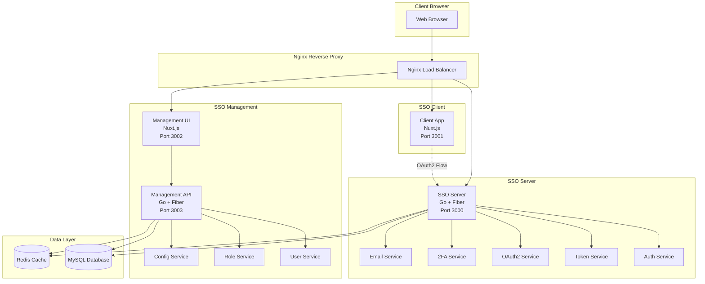
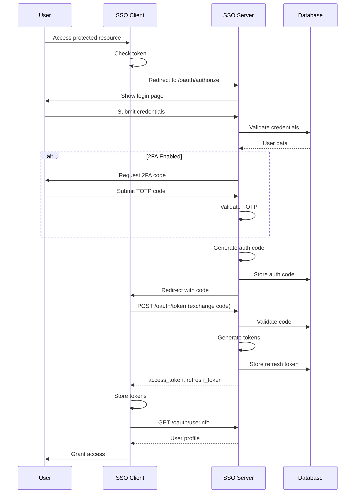
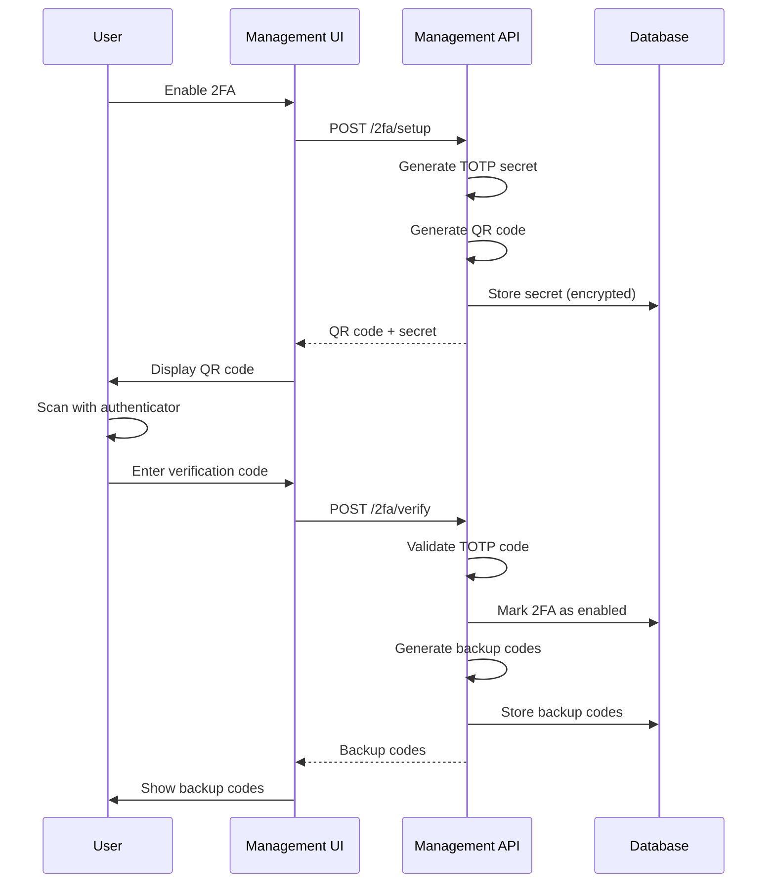
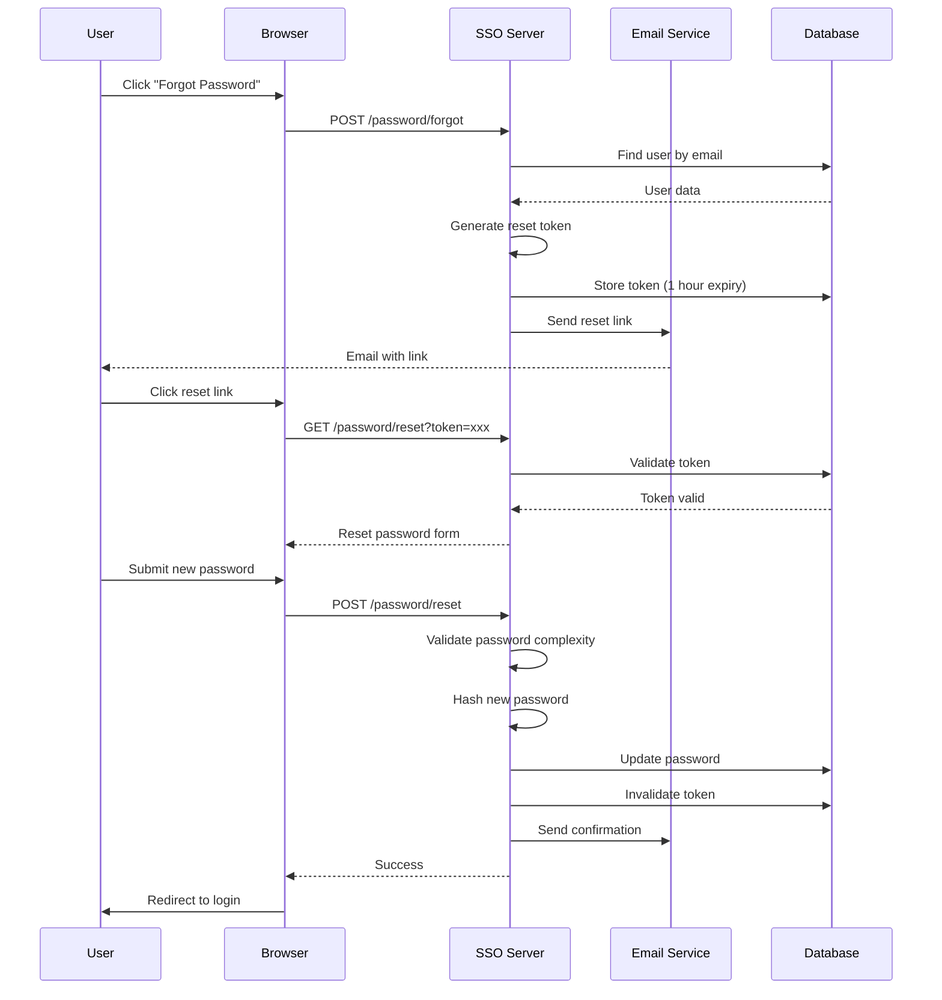

# SSO System - High Level Design (HLD)

## 1. System Architecture Overview



## 2. Component Details

### 2.1 SSO Server (Authentication Server)

**Technology Stack:**
- Language: Go 1.21+
- Framework: Fiber v2
- Database Driver: go-sql-driver/mysql
- JWT Library: golang-jwt/jwt
- 2FA Library: pquerna/otp

**Core Modules:**

#### 2.1.1 Authentication Service
**Responsibilities:**
- Validate user credentials
- Hash password comparison (bcrypt)
- Account lockout enforcement
- Login attempt tracking

**APIs:**
```
POST /auth/login
POST /auth/logout  
POST /auth/verify-2fa
POST /auth/refresh-token
```

#### 2.1.2 OAuth2 Service
**Responsibilities:**
- OAuth2 Authorization Code Flow
- Client validation
- Authorization code generation
- Token exchange

**APIs:**
```
GET  /oauth/authorize
POST /oauth/token
POST /oauth/revoke
GET  /oauth/userinfo
```

#### 2.1.3 Two-Factor Authentication Service
**Responsibilities:**
- TOTP secret generation
- QR code generation
- TOTP validation
- Backup codes management

**APIs:**
```
POST /2fa/setup
POST /2fa/verify
POST /2fa/disable
GET  /2fa/backup-codes
POST /2fa/regenerate-backup-codes
```

#### 2.1.4 Password Management Service
**Responsibilities:**
- Password reset flow
- Forgot password flow
- Password complexity validation
- Password history tracking
- Reset token generation

**APIs:**
```
POST /password/forgot
POST /password/reset
POST /password/change
GET  /password/validate
```

#### 2.1.5 Token Service
**Responsibilities:**
- JWT generation and validation
- Token refresh mechanism
- Token revocation
- Token blacklisting

**Token Structure:**
```json
{
  "header": {
    "alg": "RS256",
    "typ": "JWT"
  },
  "payload": {
    "sub": "user_uuid",
    "email": "user@example.com",
    "name": "User Name",
    "roles": ["user", "admin"],
    "permissions": ["read:profile", "write:data"],
    "client_id": "client_app_id",
    "exp": 1234567890,
    "iat": 1234567890,
    "jti": "token_uuid"
  }
}
```

#### 2.1.6 Email Service
**Responsibilities:**
- Send password reset emails
- Send password expiry warnings
- Send 2FA setup confirmations
- Send security alerts

**Email Templates:**
- Password Reset
- Password Expiry Warning
- Account Locked
- 2FA Enabled/Disabled
- Login from New Device (optional)

### 2.2 SSO Client (Example Application)

**Technology Stack:**
- Framework: Nuxt.js 3
- UI Framework: Tailwind CSS
- HTTP Client: ofetch / $fetch
- State Management: Pinia

**Core Features:**

#### 2.2.1 OAuth2 Client Implementation
**Responsibilities:**
- Initiate OAuth2 authorization flow
- Handle callback and code exchange
- Store tokens securely
- Automatic token refresh

**Flow:**
```javascript
// 1. Redirect to SSO Server
const authUrl = `${ssoServerUrl}/oauth/authorize?
  client_id=${clientId}&
  redirect_uri=${redirectUri}&
  response_type=code&
  scope=openid profile&
  state=${state}`

// 2. Handle callback
const code = route.query.code
const tokens = await exchangeCode(code)

// 3. Store tokens
setTokens(tokens)

// 4. Fetch user info
const user = await fetchUserInfo(tokens.access_token)
```

#### 2.2.2 Route Protection
**Middleware:**
```javascript
// middleware/auth.ts
export default defineNuxtRouteMiddleware((to, from) => {
  const auth = useAuthStore()
  
  if (!auth.isAuthenticated) {
    return navigateTo('/login')
  }
  
  if (auth.isTokenExpired()) {
    return auth.refreshToken()
  }
})
```

#### 2.2.3 API Communication
**Interceptors:**
- Attach access token to requests
- Handle 401 responses with token refresh
- Logout on refresh token expiry

### 2.3 SSO Management (Admin Dashboard)

**Technology Stack:**
- Backend: Go + Fiber
- Frontend: Nuxt.js 3 + Tailwind CSS
- UI Components: Headless UI / Shadcn-vue

**Backend APIs:**

#### 2.3.1 User Management API
```
GET    /api/users
GET    /api/users/:id
POST   /api/users
PUT    /api/users/:id
DELETE /api/users/:id
POST   /api/users/:id/reset-password
POST   /api/users/:id/lock
POST   /api/users/:id/unlock
GET    /api/users/:id/sessions
DELETE /api/users/:id/sessions/:sessionId
```

#### 2.3.2 Role Management API
```
GET    /api/roles
GET    /api/roles/:id
POST   /api/roles
PUT    /api/roles/:id
DELETE /api/roles/:id
GET    /api/roles/:id/permissions
POST   /api/roles/:id/permissions
DELETE /api/roles/:id/permissions/:permissionId
```

#### 2.3.3 Permission Management API
```
GET    /api/permissions
GET    /api/permissions/:id
POST   /api/permissions
PUT    /api/permissions/:id
DELETE /api/permissions/:id
```

#### 2.3.4 Client Management API
```
GET    /api/clients
GET    /api/clients/:id
POST   /api/clients
PUT    /api/clients/:id
DELETE /api/clients/:id
POST   /api/clients/:id/regenerate-secret
```

#### 2.3.5 Configuration API
```
GET    /api/config/password-policy
PUT    /api/config/password-policy
GET    /api/config/session
PUT    /api/config/session
GET    /api/config/security
PUT    /api/config/security
```

#### 2.3.6 Audit Logs API
```
GET    /api/audit-logs
GET    /api/audit-logs/:id
GET    /api/audit-logs/user/:userId
GET    /api/audit-logs/export
```

## 3. Authentication Flows

### 3.1 OAuth2 Authorization Code Flow



### 3.2 2FA Setup Flow



### 3.3 Password Reset Flow



## 4. Database Architecture

### 4.1 Database Schema Overview

**Core Tables:**
- `users` - User accounts
- `roles` - User roles
- `permissions` - System permissions
- `user_roles` - User-Role mapping
- `role_permissions` - Role-Permission mapping
- `oauth_clients` - Registered OAuth2 clients
- `oauth_authorization_codes` - Temporary auth codes
- `oauth_refresh_tokens` - Refresh tokens
- `sessions` - Active user sessions
- `two_factor_auth` - 2FA secrets and settings
- `password_reset_tokens` - Password reset tokens
- `audit_logs` - System audit trail
- `system_config` - System configuration
- `password_history` - Password history for reuse prevention

### 4.2 Data Access Patterns

**Read Heavy:**
- User authentication (frequent)
- Token validation (very frequent)
- Permission checks (very frequent)

**Write Heavy:**
- Audit logs (every action)
- Sessions (login/logout)

**Caching Strategy:**
- User permissions: Cache in Redis (TTL: 5 minutes)
- System config: Cache in Redis (TTL: 1 hour)
- JWT public keys: Cache in memory
- Rate limiting: Redis counters

## 5. Security Architecture

### 5.1 Data Security

**Encryption at Rest:**
- Database: MySQL native encryption
- Sensitive fields: AES-256 encryption
  - TOTP secrets
  - OAuth client secrets
  - Backup codes

**Encryption in Transit:**
- TLS 1.3 for all communications
- Certificate management via Let's Encrypt

**Password Security:**
- Algorithm: bcrypt
- Cost factor: 12
- No password storage in logs
- Password history: Keep last 5 passwords

### 5.2 Application Security

**OWASP Top 10 Mitigations:**

1. **Injection Prevention:**
   - Prepared statements for all queries
   - Input validation and sanitization
   - ORM usage where applicable

2. **Broken Authentication:**
   - Strong password policy
   - 2FA enforcement option
   - Session timeout
   - Account lockout

3. **Sensitive Data Exposure:**
   - TLS everywhere
   - Secure headers
   - No sensitive data in URLs
   - Proper error messages

4. **XML External Entities (XXE):**
   - No XML processing (using JSON)

5. **Broken Access Control:**
   - Role-based access control (RBAC)
   - Permission checks on every endpoint
   - Principle of least privilege

6. **Security Misconfiguration:**
   - Secure defaults
   - Minimal exposed ports
   - Regular security updates
   - No default credentials

7. **Cross-Site Scripting (XSS):**
   - Content Security Policy
   - Output encoding
   - HttpOnly cookies
   - Framework protection (Nuxt.js sanitization)

8. **Insecure Deserialization:**
   - JSON schema validation
   - Input type checking

9. **Using Components with Known Vulnerabilities:**
   - Dependency scanning
   - Regular updates
   - Automated security alerts

10. **Insufficient Logging & Monitoring:**
    - Comprehensive audit logs
    - Failed login tracking
    - Anomaly detection
    - Log retention policy

### 5.3 Rate Limiting

**Login Endpoint:**
- 5 attempts per minute per IP
- 10 attempts per hour per user
- Account lockout after 5 failed attempts (30 minutes)

**Password Reset:**
- 3 requests per hour per email
- 10 requests per day per IP

**API Endpoints:**
- 100 requests per minute per user
- 1000 requests per minute per IP

**Implementation:**
- Redis-based counters
- Sliding window algorithm

## 6. Deployment Architecture

### 6.1 Docker Compose Structure

```yaml
services:
  nginx:
    image: nginx:alpine
    ports: ["80:80", "443:443"]
    
  sso-server:
    build: ./sso-server
    environment:
      - DB_HOST=mysql
      - REDIS_HOST=redis
    depends_on: [mysql, redis]
    
  sso-client:
    build: ./sso-client
    environment:
      - SSO_SERVER_URL=https://sso.example.com
    
  sso-management-api:
    build: ./sso-management/api
    depends_on: [mysql, redis]
    
  sso-management-ui:
    build: ./sso-management/ui
    environment:
      - API_URL=http://sso-management-api:3003
    
  mysql:
    image: mysql:8.0
    volumes: [mysql-data:/var/lib/mysql]
    environment:
      - MYSQL_ROOT_PASSWORD=<secure>
      
  redis:
    image: redis:7-alpine
    volumes: [redis-data:/data]
```

### 6.2 Environment Configuration

**Development:**
- Local Docker Compose
- Hot reload enabled
- Debug logging
- Seed data

**Staging:**
- Docker Compose / Kubernetes
- SSL certificates
- Production-like data
- Integration testing

**Production:**
- Kubernetes cluster
- Auto-scaling
- Load balancing
- High availability
- Database replication
- Regular backups

## 7. Monitoring & Observability

### 7.1 Metrics

**Application Metrics:**
- Request rate
- Response time (p50, p95, p99)
- Error rate
- Active sessions count
- Login success/failure rate

**Infrastructure Metrics:**
- CPU usage
- Memory usage
- Disk I/O
- Network traffic
- Container health

### 7.2 Logging

**Log Levels:**
- ERROR: Application errors, auth failures
- WARN: Security alerts, rate limiting
- INFO: Successful logins, config changes
- DEBUG: Development only

**Log Format:**
```json
{
  "timestamp": "2026-01-26T11:00:00Z",
  "level": "INFO",
  "service": "sso-server",
  "user_id": "uuid",
  "ip": "192.168.1.1",
  "action": "login",
  "result": "success",
  "message": "User logged in successfully"
}
```

### 7.3 Alerting

**Critical Alerts:**
- High error rate (>5%)
- Database connection failures
- Service downtime
- Security breaches

**Warning Alerts:**
- High response time (>1s)
- High CPU/Memory usage (>80%)
- Unusual login patterns
- Rate limit triggers

## 8. API Design Principles

### 8.1 RESTful API Standards

**Naming Conventions:**
- Resource-based URLs
- Plural nouns for collections
- HTTP methods for actions
- Consistent error responses

**Example:**
```
GET    /api/users          # List users
GET    /api/users/:id      # Get user
POST   /api/users          # Create user
PUT    /api/users/:id      # Update user
DELETE /api/users/:id      # Delete user
```

### 8.2 Response Format

**Success Response:**
```json
{
  "success": true,
  "data": {
    "id": "uuid",
    "email": "user@example.com"
  },
  "message": "User created successfully"
}
```

**Error Response:**
```json
{
  "success": false,
  "error": {
    "code": "VALIDATION_ERROR",
    "message": "Invalid input data",
    "details": {
      "email": ["Invalid email format"]
    }
  }
}
```

### 8.3 Pagination

```
GET /api/users?page=1&limit=20&sort=created_at&order=desc
```

**Response:**
```json
{
  "data": [...],
  "pagination": {
    "current_page": 1,
    "total_pages": 10,
    "total_items": 200,
    "items_per_page": 20
  }
}
```

## 9. Testing Strategy

### 9.1 Unit Tests
- Business logic testing
- Service layer testing
- Utility function testing
- Target: 80% code coverage

### 9.2 Integration Tests
- API endpoint testing
- Database integration testing
- OAuth2 flow testing
- Email service testing

### 9.3 E2E Tests
- Complete user journeys
- OAuth2 flows
- 2FA setup and login
- Password reset flow

### 9.4 Security Tests
- Penetration testing
- SQL injection testing
- XSS testing
- Authentication bypass testing
- Rate limiting validation

## 10. Performance Requirements

### 10.1 Response Time SLA
- API endpoints: < 200ms (p95)
- Login flow: < 2s (including 2FA)
- Token generation: < 100ms
- Database queries: < 50ms

### 10.2 Scalability
- Support 10,000 concurrent users
- Handle 1,000 logins per minute
- Database connection pooling
- Horizontal scaling capability

### 10.3 Availability
- Uptime: 99.9% (8.76 hours downtime/year)
- Zero-downtime deployments
- Database automatic failover
- Health check endpoints

---

**Document Version**: 1.0  
**Last Updated**: 2026-01-26  
**Status**: Draft
